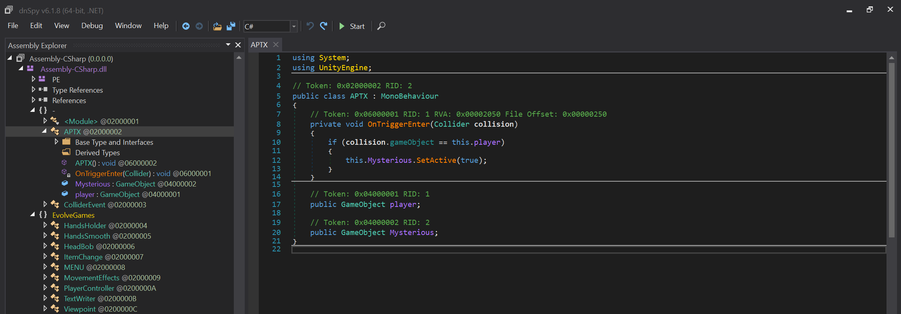

# No way out

## Challenge

Put this flag in standard picoCTF format before submitting. If the flag was `h1_1m_7h3_f14g` submit `picoCTF{h1_1m_7h3_f14g}` to the platform.

[Windows game](https://artifacts.picoctf.net/c/285/win.zip), [Mac game](https://artifacts.picoctf.net/c/285/mac.app.zip)

## Solution

Launching the provided executable, we note that we're in a Unity game. We seemingly need to exit the structure that we're in, but there is an invisible wall surrounding it.


We will use [dnSpy](https://github.com/dnSpy/dnSpy) to modify the code of this Unity game. Open dnSpy, then open the game code with File > Open and select `pico_Data/Managed/Assembly-CSharp.dll`.

There are many possible edits to the code to get the flag. One possibility is editing the code controlling the player to be able to walk through or fly over the wall. For this challenge, we'll make the flag appear as soon as the game starts.

After exploring the modules within the code, we see the following class:



It's related to a "Mysterious" game object and it's seemingly activated when the player enters a certain location, so it's likely related to the flag.

We can edit the class by right clicking and selecting `Edit Class (C#)...`. We change the OnTriggerEnter method to the following:

```C#
private void Awake()
{
	this.Mysterious.SetActive(true);
}
```

This will activate the Mysterious object when the game begins. We click Compile, then File > Save Module..., and click OK. Running the game again we see the flag immediately:


`picoCTF{WELCOME_TO_UNITY!!}`
