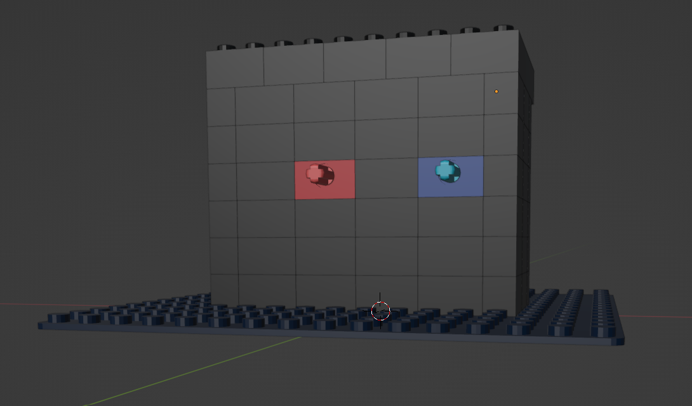
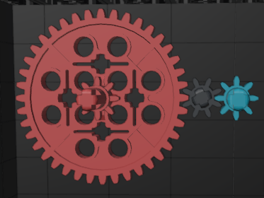

# Virtual Machine 0

# Challenge

Can you crack this black box?
We grabbed this design doc from enemy servers: [Download](https://artifacts.picoctf.net/c/358/Virtual-Machine-0.zip).
We know that the rotation of the red axle is input and the rotation of the blue axle is output.
The following input gives the flag as output: [Download](https://artifacts.picoctf.net/c/358/input.txt).

## Solution

The design doc is a .dae file, a type of 3D model. This can be opened in Blender through File > Import > Collada.

Selecting the bricks and pressing 'h' hides them, allowing us to see inside.

There are 40 gears on the red gear and 8 gears on the blue gear, which is a gear ratio of 5. The rotation of the red gear, which is the input, is multiplied by 5 to get the output, which is the rotation of the blue gear.

Because the input is `39722847074734820757600524178581224432297292490103995897672826024691504153`, the output is `198614235373674103788002620892906122161486462450519979488364130123457520765`. The hexadecimal representation of this number is `7069636F4354467B67333472355F30665F6D3072335F30356535313034647D`, which gives the flag when converted to ASCII:

`picoCTF{g34r5_0f_m0r3_05e5104d}`