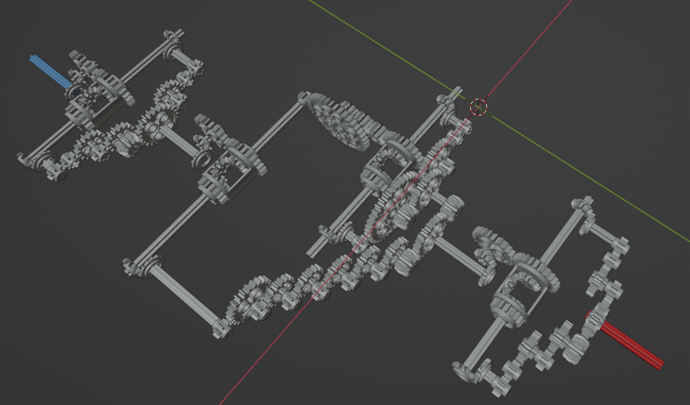
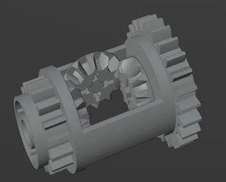

# Virtual Machine 1

# Challenge

The enemy has upgraded their mechanical analog computer. Start an instance to begin.

We grabbed this design doc from enemy servers: [Download](https://artifacts.picoctf.net/c/265/Virtual-Machine-1.zip). We know that the rotation of the red axle is input and the rotation of the blue axle is output. Reverse engineer the mechanism and get past their checker program:

## Solution

The design doc is again a .dae file, a type of 3D model. This can be opened in Blender through File > Import > Collada.

The mechanism is now much more complicated, but follows the same principle of gear ratios. From the red input, there are multiple branching paths, which reconnect at an unknown piece:

Searching online for Lego gear pieces, this can be identified as a differential, which has 3 inputs/outputs. It functions by outputting the average of 2 inputs to the remaining gear.

From every fork, we calculate the gear ratio of the left and right paths, then average them when they combine at the differential, resulting in 3 distinct sections. This is made simple using [this](http://gears.sariel.pl/) website to keep track.

First Section: (beginning from the red input)

- Left: 8

- Right: 6

- Average: 7

Second Section:

- Left: 192

- Right-Left: 200

- Right-Right: 180

- Right Average: 190

- Average: 191

Third Section:

- Left: 8

- Right: 6

- Average: 7

Multiplying the result of these 3 sections, the total ratio is 9359.

We connect to the server and multiply the input by 9359 to get the output and the flag.

`picoCTF{m0r3_g34r5_3g4d_eaff8cfd}`
