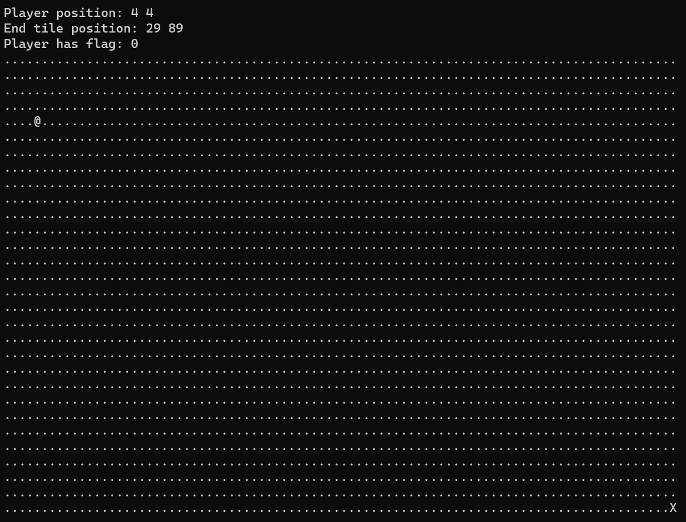
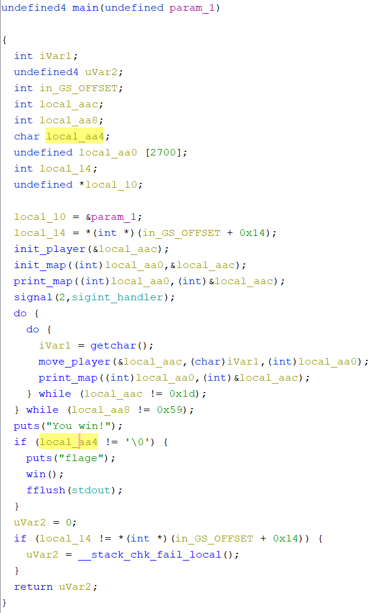
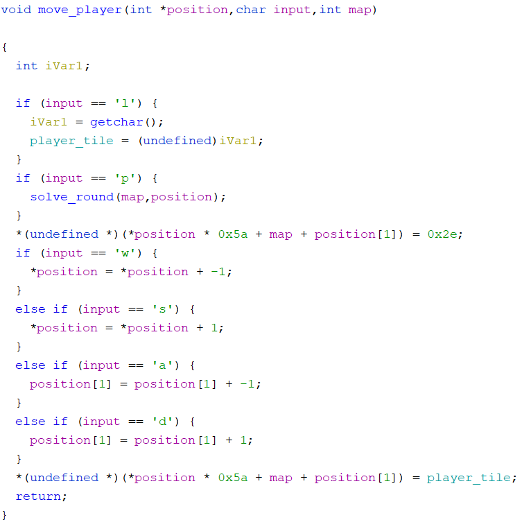
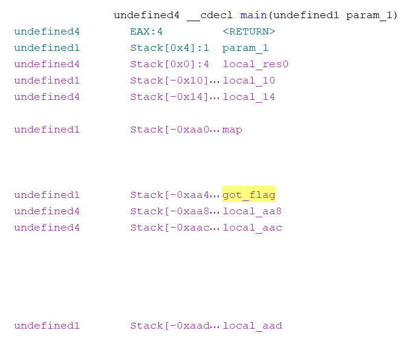

# babygame01

## Challenge

Get the flag and reach the exit.

Welcome to BabyGame! Navigate around the map and see what you can find! The game is available to download [here](https://artifacts.picoctf.net/c/221/game). There is no source available, so you'll have to figure your way around the map.

## Solution

Connecting to the server, we are me with a game. We can use WASD to move the `@` around the grid.

Moving the `@` to the `X` in the bottom-right ends the game.

To get more information of the inner workings of the game, we load the `game` executable in Ghidra through File > Import File, importing it with the default values. Then, we open it, answering Yes to the analysis prompt, enabling the Decompiler Parameter ID option, and clicking Analyze.

This binary has debugging information included and it's fairly easy to examine the `main` function:

We can see that if the `local_aa4` variable is non-zero, then the flag will be outputted at the end of the game, but this variable is not modified anywhere. We can rename this and other variables to make our analysis easier by right clicking > Rename variable or the keyboard shortcut `l`.

We examine how the player-moving function works. After renaming some variables, it looks like this:

We've discovered additional commands. Using `l` then another character switches the player character from `@` (initially) to a different character. Using `p` is essentially a shortcut to beat the game, though not exactly.

Moreover, from this and the `main` function, we see that each input acts on a 2700 character array that makes up the `map`. During each movement, the current position of the player is replaced with a dot, then the player's position is updated, and finally the player's new position is replaced with `player_tile`.

We note that if the player's position is outside of the bounds of the map array, it will still overwrite that memory location with the `player_tile`. So, we have a way to enable the flag variable.

We look at the makeup of the stack:

We see that the flag variable is directly before the map array in the stack. Although it's of a 1-byte datatype, it takes up 4 bytes in the stack due to data alignment.

To make the variable non-zero we simply have to move our character to the beginning of the map and go to the left 4 times. Then, we can simply use the `p` command and win to receive the flag.

`picoCTF{gamer_m0d3_enabled_2bcdc8e6}`
